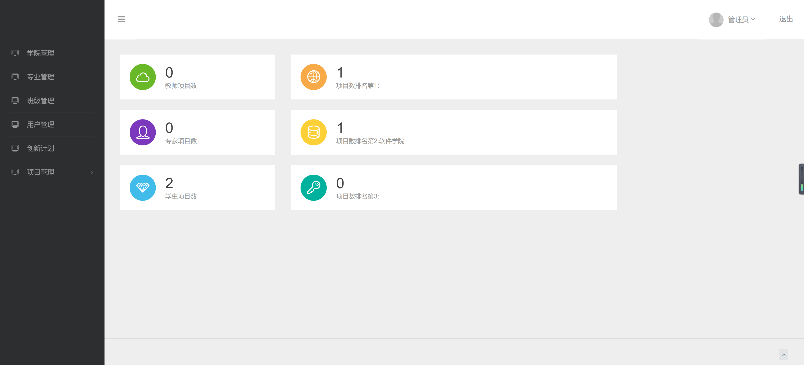
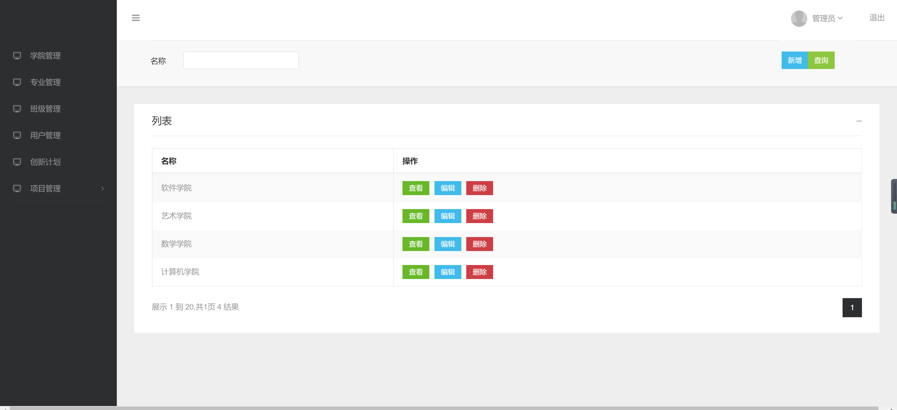
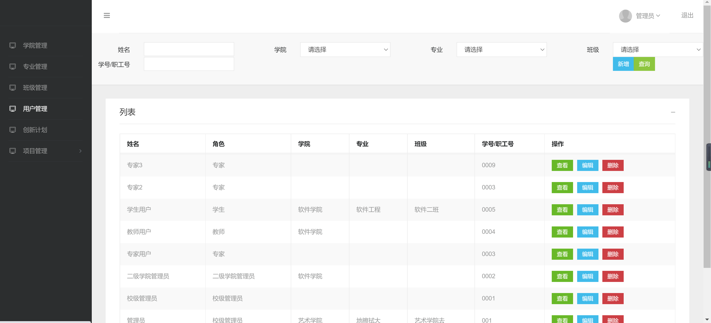
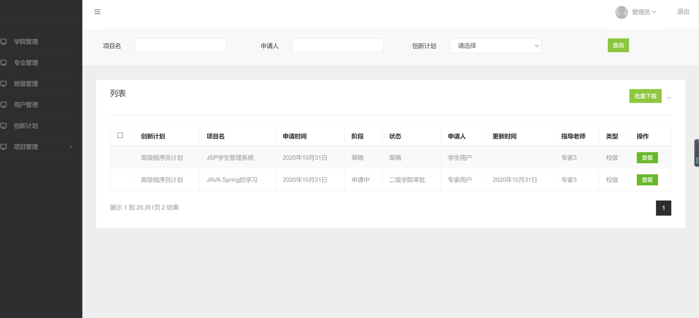

<h1 align="center">大学生创新创业项目管理系统</h1>

## 简介
大学生创新创业项目管理系统：提供用户管理、学院管理、创新计划和项目管理功能，支持用户身份认证、信息查询与编辑、统计分析及批量操作，提高管理效率与安全性。    --计算机毕业设计源码；毕设源码；java毕业设计源码

## 联系方式

<h3 align="center">获取完整代码与数据库文件 + 微信：bysj5151 QQ: 86050149 QQ群: 783742310</h3>

<h3 align="center">可帮忙远程部署 包运行成功！提供远程部署、修改代码、设计文档指导、代码讲解等服务！</h3>

## 功能介绍（完整见运行截图）
管理员：基本功能包括用户认证，通过用户名、密码和验证码的方式登录系统。提供学院管理、专业管理、班级管理和用户管理功能，支持增删查改用户信息和权限分配。提供创新计划和项目管理模块，能够查看项目数量统计，管理项目的申请、更新与状态，并进行项目详情查看和批量下载。

用户：通过登录界面进行身份认证后，用户可以根据权限访问系统。用户能够利用项目搜索功能查找和筛选特定项目，查看包括项目名、申请人、创新计划等信息。通过用户管理界面，用户可以查询自己的基本信息，并按照权限进行信息修改。参与创新计划和项目的申请，查看其状态，方便参与项目的管理和实施。

## 运行截图

本代码来源于网络,仅供学习参考使用!

